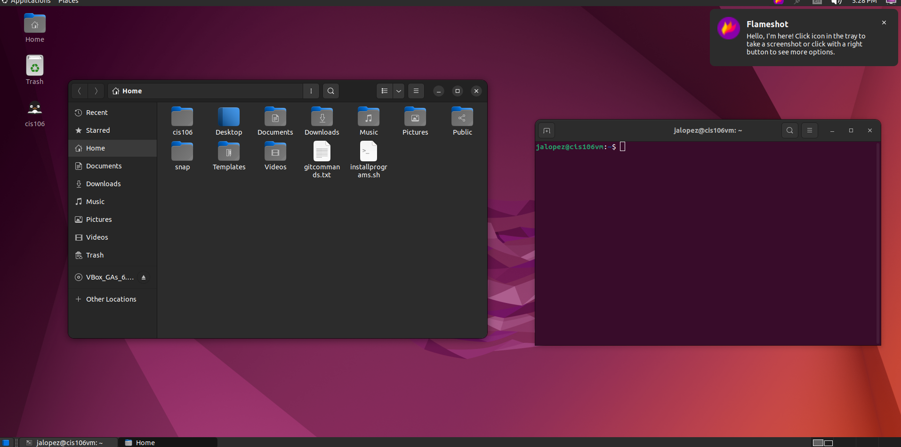

# Lab 3 Submission

## Question 1
Has no submission

## Question 2

## Question 3

| Program purpose     | Package Name | Version                  |
| ------------------- | ------------ | ------------------------ |
| Play a tetris game  | blockattack  | 2.7.0-1 amd64            |
| Play a video file   | dragonplayer | 4:21.12.3-0ubuntu1 amd64 |
| Browse the internet | dillo        | 3.0.5-7build1 amd64      |
| Read your email     | geary        | 40.0-2 amd64             |
| Play music          | rhythmbox    | 3.4.4-5ubuntu1 amd64     |

1. Which command did you use to install?
        apt install (program name) -y
2. Which command did you use to remove?
        apt remove (program name) -y
3. Which command did you use to install and remove?
        apt install (program name)+ (program name)- -y

## Question 4

| command | what it does               |
| ------- | -------------------------- |
| echo    | Displays a line of text    |
| fortune | Prints a random epigram    |
| cowsay  | Creates speaking cow       |
| lolcat  | Rainbow coloring effect    |
| figlet  | Displays large characters  |
| toilet  | Large colorful characters |
| rig     | Random Identity Generator  |