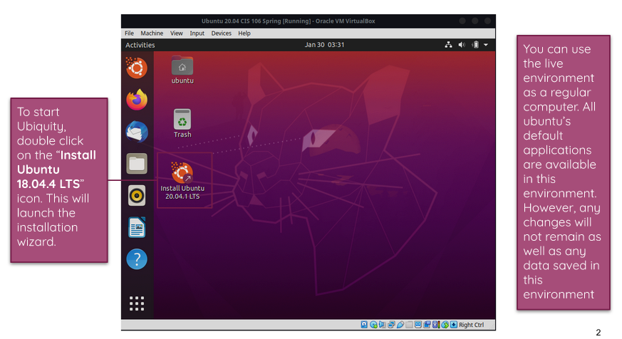
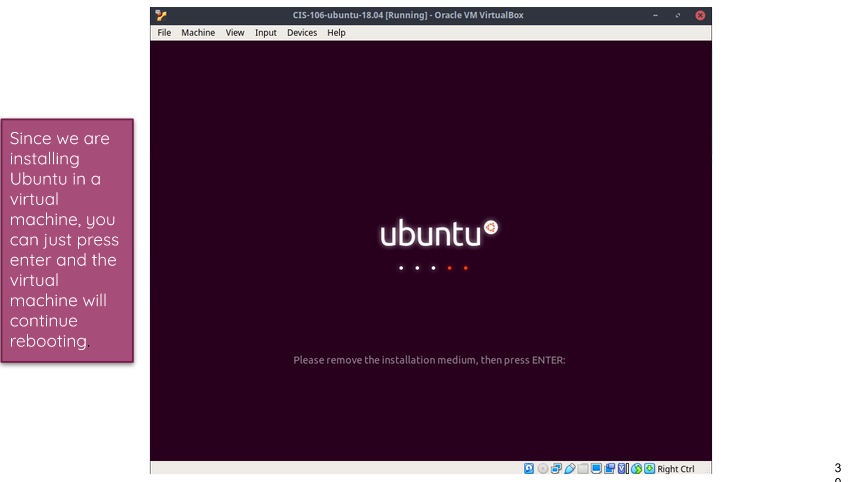

# Week Report 2

## The Basics of Virtualization
**What is virtualization**

Replication of hardware to simulate a virtual machine inside a physical machine

1. **Types of virtualization**

Server-side Virtualization
Programs and operations of virtualization is run on the server.

Client-side Virtualization
Programs and operation of virtualization is run on the client

## Installing Ubuntu in Virtualbox

* Ubuntu Installation

### Step 1

### Step 2

### Step 3

### Step 4

