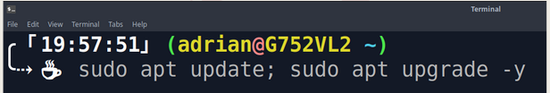
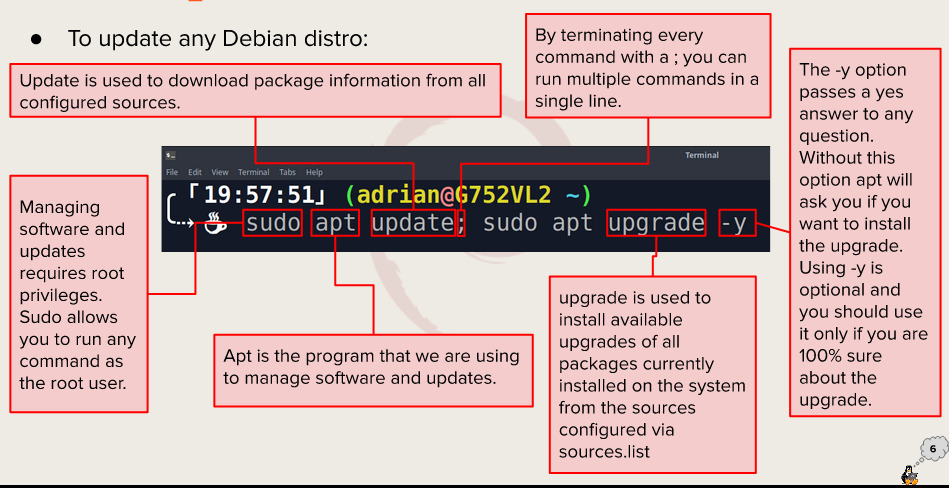

# Week Report 3

## Exploring Desktop Environments
**Types of Desktop Environments**
1. GNOME
2. KDE Plasma
3. Cinnamon
4. XFCE

**Definitions**

Gui - Graphical user interface is a set of programs that allows a user to interact with the computer system via icons, windows, and various other visual elements.

DE - A desktop environment is an implementation of the desktop metaphor made of a bundle of programs running on top of a computer operating system, which shares a common GUI, sometimes described as a graphical shell.

**Common Elements of Desktop Environment**
1. Desktop Settings
2. Display Manager
3. File Manager
4. Icons
   
## The Bash Shell
**What is a shell?**

A shell is a computer program that exposes an operating system's services to a human user or other programs.

**List of different shells**
1. Tcsh Shell
2. Csh Shell
3. Ksh Shell
4. Fish Shell
5. Zsh Shell

**Some Bash Shortcuts**
1. Command Editing
2. Command Recall
3. Command Controls
4. Bash Bang (!) Commands

**Basic Commands**
| Basic Shortcut   | Usage                    |
| ---------------- | ------------------------ |
| Ctrl + A         | Go to the start          |
| Ctrl + E         | Go to the end            |
| Ctrl + C         | Terminate the command    |
| Ctrl + Z         | Suspend/Stop the command |
| !!               | Run last command         |
| Ctrl + Shift + C | Copies                   |
| Ctrl + Shift + V | Pastes                   |

## Managing Software
1. **Commands**

**Command for updating Ubuntu**

**Command for installing software**

**Command for removing software**

**Command for searching for software**

2. **Definition**
   
Package - Archives that contain binaries of software, configuration files, and information about dependencies.

Library - Reusable code that can be used by more than one function or program.

Repository - A large collection of software available for download.

## How to update Ubuntu

