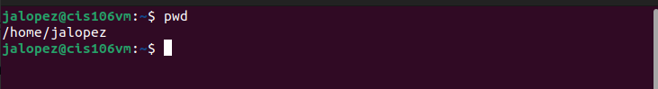
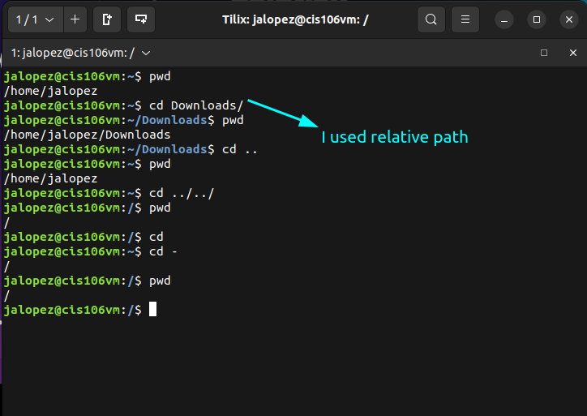
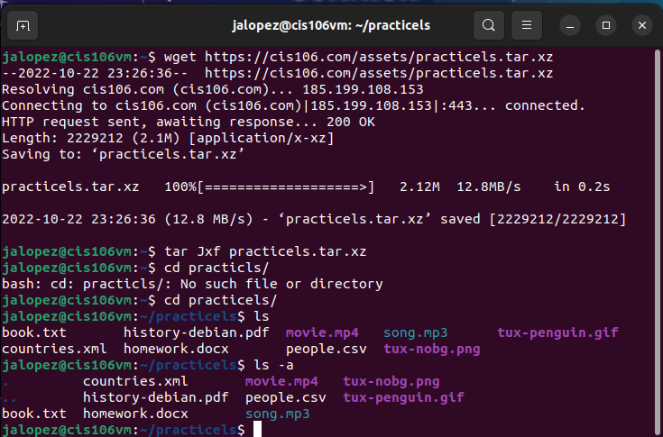
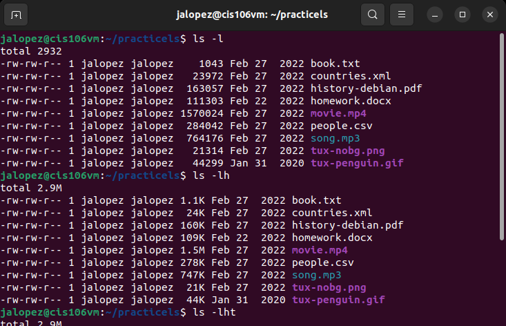

# Week Report 4

## Practice

## The Filesystem (Some important Directories)

| Directory | Data Stored in Directory                                                             |
| --------- | ------------------------------------------------------------------------------------ |
| bin       | Essential Commands                                                                   |
| dev       | Device files                                                                         |
| etc       | System configuration files                                                           |
| home      | User home directories                                                                |
| media     | Mount point for removable media                                                      |
| opt       | Add-on software packages                                                             |
| proc      | Kernel information, process control                                                  |
| srv       | Information relating to services run on the system                                   |
| usr       | Software not essential for system operation                                          |
| var       | Dedicated to variable data such as log files that persist from one boot to the next. |

## Commands to navigate the filesystem

| Command | What it does                             | Syntax | Example         |
| ------- | ---------------------------------------- | ------ | --------------- |
| pwd     | prints current working directory         | `pwd`  | `pwd`           |
| cd      | changes current working directory        | `cd`   | `cd Downloads\` |
| ls      | lists files in current working directory | `ls`   | `ls`            |

## Key terms

*Definitions of the following terms*

* File system: The way files are stored and organized.
* Current directory: Directory where you are at the moment.
* parent directory: A directory that has other directories inside.
* the difference between YOUR HOME directory and THE HOME directory: YOUR HOME directory contains your user data, while THE HOME directory holds all the data.
* pathname: Indicates the location of the file.
* relative path: The location of a file starting the root of the file system
* absolute path: The location of a file starting from the current working directory.
* A bulleted list of all the commands are used for navigating the filesystem.
  * pwd
  * cd
  * ls
