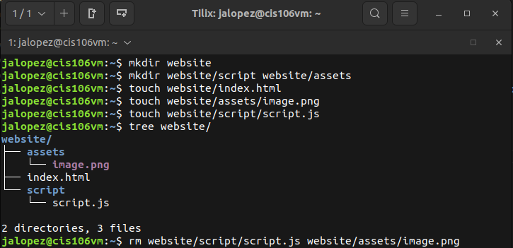
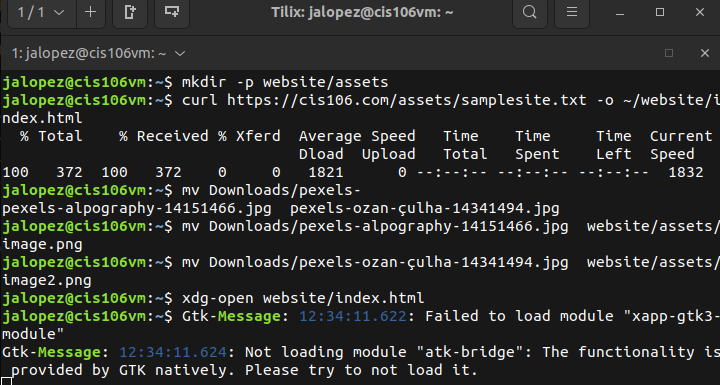
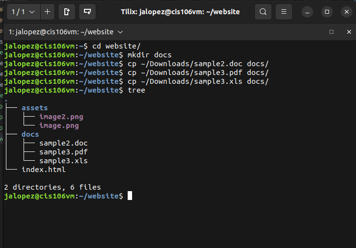

# Week Report 5

## What are Command Options?
Commands are often followed by options that modify/enhance their behavior.

## What are Command Arguments?
Commands are also followed by arguments which are the items open which the command acts on.

## Which command is used for creating directories? Provide at least 3 examples.

The command for creating directories is mkdir. You would simply type: `mkdir (name of directory)`
Examples: `mkdir gameclips`, `mkdir mods`, `mkdir edited-photos`

## What does the touch command do? Provide at least 3 examples.
The touch command is used to create files. Simply type `touch (file)`
Examples: `touch list`, `touch ~/Downloads/games.txt`, `touch file.md`

## How do you remove a file? Provide an example.
To remove a file type `rm + file name`
Example: `rm ~/Downloads/games.txt`

## How do you remove a directory and can you remove non-empty directories in Linux? Provide an example
You can remove directories in two ways. One way is by using the rm command with the -r option and the other way is to remove it by using the rmdir command. Keep in mind with Linux you cannot remove non empty directories unless you use the `rm -r (path)` command. 
Example: `rm -r GameClips/`, `rmdir Files`

## Explain the mv and cp command. Provide at least 2 examples of each
The mv command can move and or rename the source. The cp command can copy files from one directory to another but if you add the -r option you can copy directories.
Example: `mv /Downloads/homework.pdf Documents/`, `cp Downloads/wallpapers/* ~/Pictures/`

## Practice
* Practice 1
 
* Practice 2
 
* Practice 3
 
Opened the file on my firefox browser.
* Practice 4
 
Saw the samples that I copied from the Downloads folder.